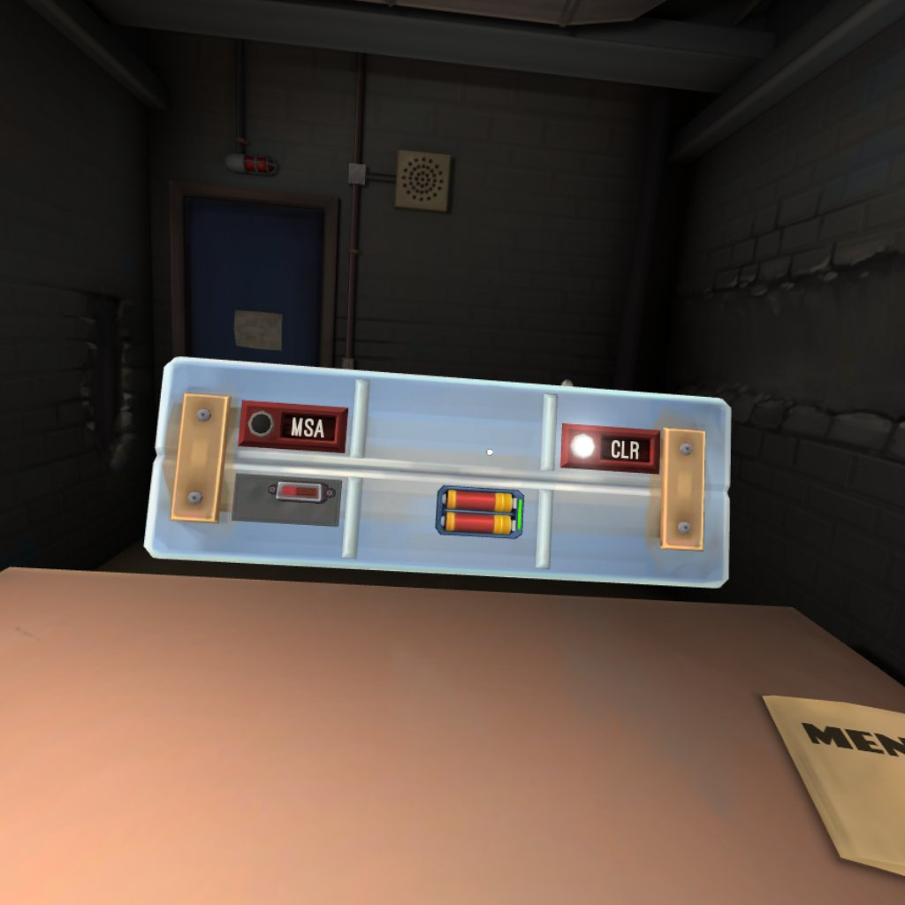

## Calculating Bomb Length
Length of battery in image: 6.69mm
Actual length of battery: 50mm
Length of Bomb in image: 55.4mm
Actual bomb length = 55.4(50/6.69) = 414mm

## Calculating Bomb Depth
Bomb length in image: 651 pixels
Actual Bomb length: 414mm
Bomb depth in image: 225 pixels
Actual Bomb depth = 225(414/651) = 143mm

there's meant to be another image here for the module calculation but i grabbed it from online and cant find it again lol

## Calculating module size
Bomb length in image: 989 pixels
Actual Bomb length: 414mm
Module size in image: 286 pixels
Actual size of module = 286(414/989) = 120mm

